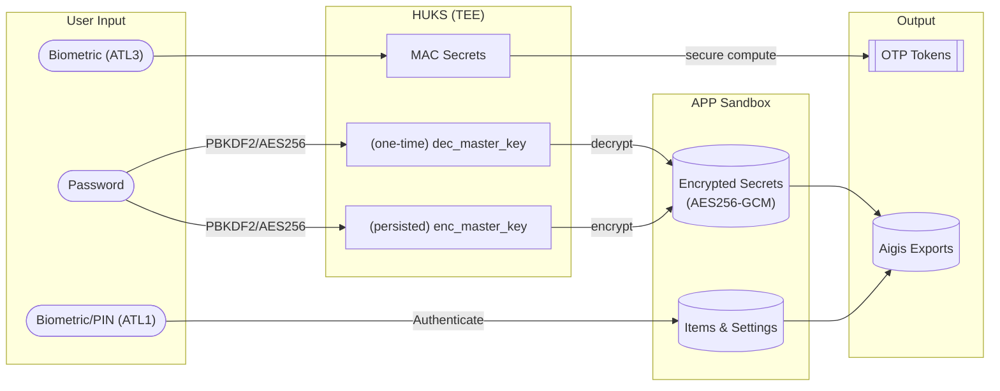

# Aigis

> [!NOTE]
> 本元服务已正式上架应用市场，请搜索“Aigis”使用！

A lightweight alternative to [Aegis Authenticator](https://github.com/beemdevelopment/Aegis) for HarmonyOS NEXT, with pure ArkTS implementation and no 3rd party dependencies.

  
  &nbsp;&nbsp;&nbsp;&nbsp;
  

### Security Design (for version `>=1.0.0`)

**Fallback Security Design**: If ATL3 is invalidated for any reason, the password will be prompted to decrypt the "Encrypted Secrets", and then re-imported to overwrite "MAC secrets" in HUKS without auth required. If ATL1 is invalidated for any reason, the APP will be inaccessible until reinstalled.

### Roadmap

**Release v0.3.0** (2024/11/15)

- [ ] Choose TouchID / FaceID First Authentication
- [ ] Support QR Code for `otpauth-migration` transfer link
- [ ] Fix page transition animation (#13)
- [ ] Access Control with Biometric Authentication
  - Encrypt secrets with `enc_master_key` (HUKS with no auth)
- [ ] Fix Steam Token (b64) Import (#19)

**Release v0.3.1**

- [ ] Item Sorting "Custom / Alphabetic / Usage Count"
- [ ] Support Drag Item to Sort (#16)

**Release v0.5.0** (2024/11/22)

- [ ] ATL3 Authentication
  - Import MAC secrets to HUKS with ATL3 auth access
  - Request Password to disable Biometric Auth
  - Require password to re-import (overwrite) the secrets in HUKS

**Release v0.6.0** (2024/11/29)

- [ ] Change Password Procedure Design
- [ ] Password Challenge Design
  - Password Challenge Periodic Notification

**Release v1.0.0**:

- [ ] [Aegis](https://github.com/beemdevelopment/Aegis) format vault import & export

### References

- [Aegis Authenticator - ctypto/otp](https://github.com/beemdevelopment/Aegis/tree/master/app/src/main/java/com/beemdevelopment/aegis/crypto/otp)

- [Github - pyotp](https://github.com/pyauth/pyotp.git)

- HarmonyOS NEXT 官方文档
  
  - [文档中心 - 元服务开发指南](https://developer.huawei.com/consumer/cn/doc/atomic-guides-V5/atomic-service-V5)

  - [文档中心 - 设计指南](https://developer.huawei.com/consumer/cn/doc/design-guides/design-concepts-0000001795698445)

  - [文档中心 - 开发指南](https://developer.huawei.com/consumer/cn/doc/harmonyos-guides-V5/application-dev-guide-V5?catalogVersion=V5)

  - [文档中心 - API参考](https://developer.huawei.com/consumer/cn/doc/harmonyos-references-V5/development-intro-api-V5?catalogVersion=V5)
