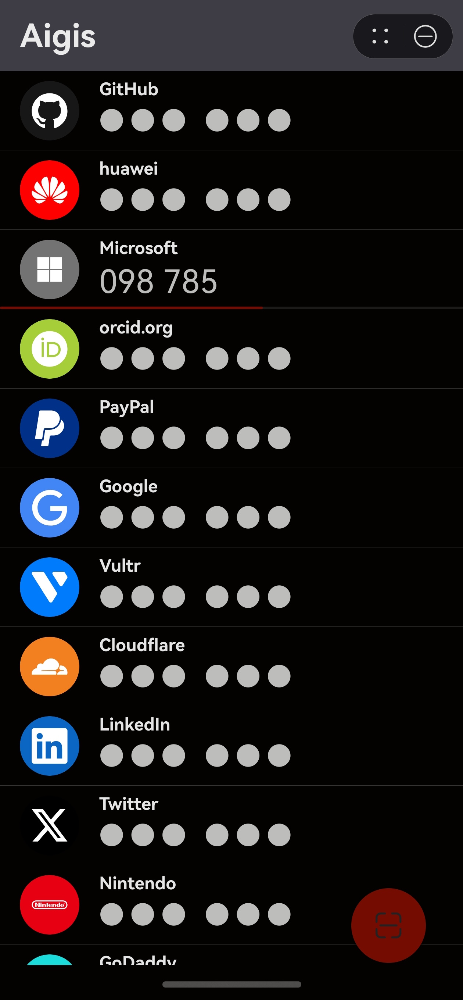

# Aigis

> [!NOTE]
> 本元服务预计于10月底正式上架，敬请期待！

A lightweight alternative to [Aegis Authenticator](https://github.com/beemdevelopment/Aegis) for HarmonyOS NEXT, with pure ArkTS implementation and no 3rd party dependencies.

  
  &nbsp;&nbsp;&nbsp;&nbsp;
  

### Security Design

**Fallback Security Design**: If ATL3 is invalidated for any reason, the password will be prompted to decrypt the "Encrypted Secrets", and then re-imported to overwrite "MAC secrets" in HUKS without auth required. If ATL1 is invalidated for any reason, the APP will be inaccessible until reinstalled.

### TODO

**Test v0.2.5**:

- [x] Main Page with ATL1 Authentication
  - Discard previous biometric auth when in background
- [ ] Access Control with Biometric Authentication
    - Encrypt secrets with `enc_master_key` (HUKS with no auth)
    - Import MAC secrets to HUKS with ATL3 auth access
    - Request Password to disable Biometric Auth
- [ ] Biometric Failure Fallback
  - Require password to re-import (overwrite) the secrets in HUKS

**Release v1.0.0**:
- [ ] Change Password Procedure Design
- [ ] More Setting Items
  - Disable Account Name Display / Only Show with duplicate issuers
  - Code Split Digits Option (2/3/4/'Even'/'None')
  - Color Theme: Default / Light / Dark
- [ ] Better Icon Match

### TODO
- [ ] Password Challenge Design
    - Password Challenge Periodic Notification
- [ ] More Import / Export Support (e.g., Aegis)

### References

- [Aegis Authenticator - ctypto/otp](https://github.com/beemdevelopment/Aegis/tree/master/app/src/main/java/com/beemdevelopment/aegis/crypto/otp)

- [Github - pyotp](https://github.com/pyauth/pyotp.git)

- HarmonyOS NEXT 官方文档
  
  - [文档中心 - 元服务开发指南](https://developer.huawei.com/consumer/cn/doc/atomic-guides-V5/atomic-service-V5)

  - [文档中心 - 设计指南](https://developer.huawei.com/consumer/cn/doc/design-guides/design-concepts-0000001795698445)

  - [文档中心 - 开发指南](https://developer.huawei.com/consumer/cn/doc/harmonyos-guides-V5/application-dev-guide-V5?catalogVersion=V5)

  - [文档中心 - API参考](https://developer.huawei.com/consumer/cn/doc/harmonyos-references-V5/development-intro-api-V5?catalogVersion=V5)
