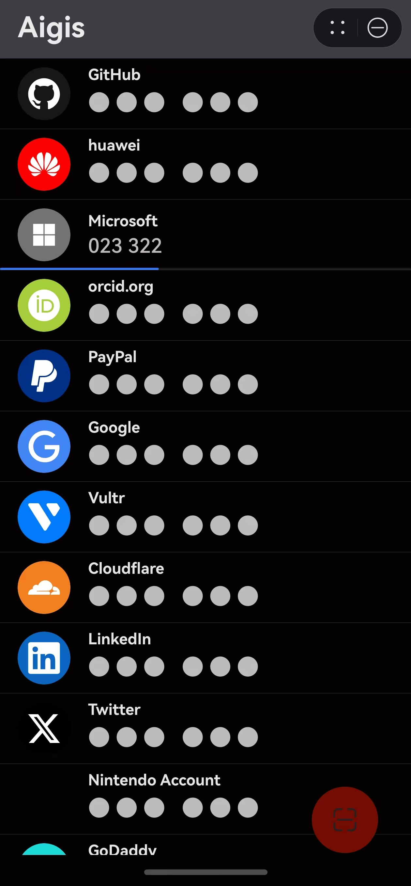

# Aigis

A lite alternative to [Aegis Authenticator](https://github.com/beemdevelopment/Aegis) for HarmonyOS NEXT, with pure ArkTS implementation and no 3rd party dependencies.

### TODO

- [x] Entry Card Design

**Release v0.2.0**:
- [ ] Access Control with Authentication
- [ ] HUKS for MAC Key storage (cannot export)

**Release v0.3.0**:
- [ ] Item Sort / Filter / Removal
- [ ] Custom Icon
- [ ] Settings Page Design
- [ ] Bulky Export & Import

### References

- [Aegis Authenticator - ctypto/otp](https://github.com/beemdevelopment/Aegis/tree/master/app/src/main/java/com/beemdevelopment/aegis/crypto/otp)

- [Github - pyotp](https://github.com/pyauth/pyotp.git)

- HarmonyOS NEXT 官方文档
  
  - [文档中心 - 元服务开发指南](https://developer.huawei.com/consumer/cn/doc/atomic-guides-V5/atomic-service-V5)

  - [文档中心 - 设计指南](https://developer.huawei.com/consumer/cn/doc/design-guides/design-concepts-0000001795698445)

  - [文档中心 - 开发指南](https://developer.huawei.com/consumer/cn/doc/harmonyos-guides-V5/application-dev-guide-V5?catalogVersion=V5)

  - [文档中心 - API参考](https://developer.huawei.com/consumer/cn/doc/harmonyos-references-V5/development-intro-api-V5?catalogVersion=V5)

- **Page Modal Transition - Bind Sheet** ([link](https://developer.huawei.com/consumer/cn/doc/harmonyos-references-V5/ts-universal-attributes-sheet-transition-V5#bindsheet))
