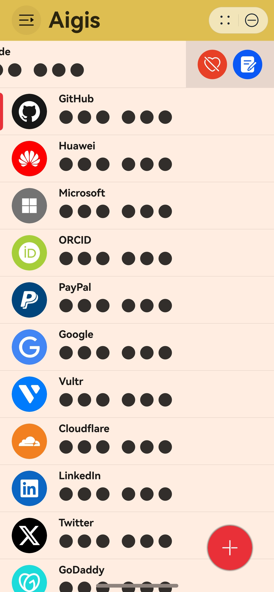
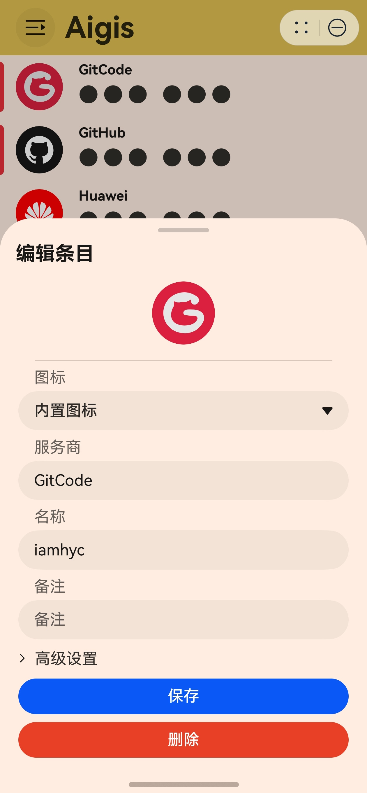
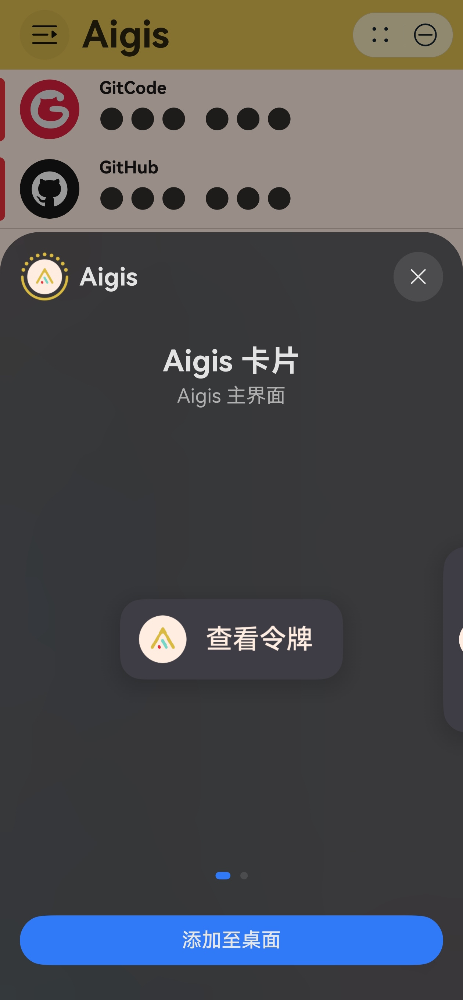
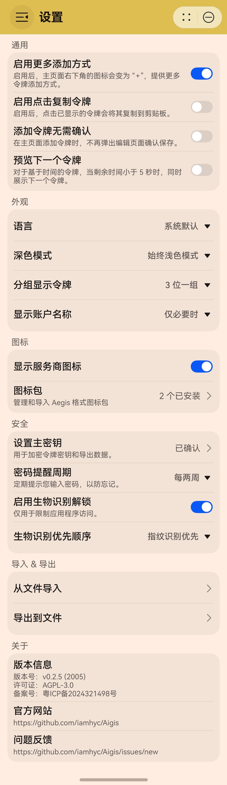
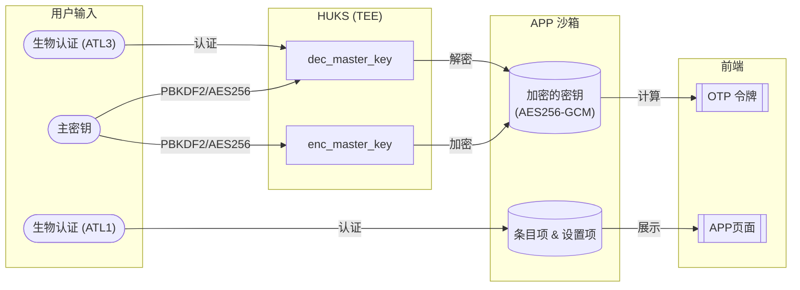

# Aigis 认证器

> [!NOTE]
> 本元服务已正式上架应用市场，请搜索“Aigis”使用！

HarmonyOS NEXT 的 [Aegis Authenticator](https://github.com/beemdevelopment/Aegis) 的轻量级替代品，采用纯 ArkTS 实现，无任何三方依赖。

  	
  	&nbsp;&nbsp;
  	
  	&nbsp;&nbsp;
    
  	&nbsp;&nbsp;
  	

### 安全设计 (for version `>=2.0.0`)

**安全回退设计**: 如果 ATL3 因任何原因失效，系统将提示输入密码以解密 “加密密钥”，然后重新导入 “dec_master_key”，但不进行授权。如果 ATL1 因任何原因失效，APP 将无法访问，直至重新安装。

### 路线图

请参考置顶议题 [Aigis 路线图](https://github.com/iamhyc/Aigis/issues/28)

### 贡献指南

> TODO

### 参考内容

- [Aegis Authenticator - ctypto/otp](https://github.com/beemdevelopment/Aegis/tree/master/app/src/main/java/com/beemdevelopment/aegis/crypto/otp)

- [Aegis Authenticator - docs/decrypt.py](https://github.com/beemdevelopment/Aegis/blob/master/docs/decrypt.py)

- [Github - pyotp](https://github.com/pyauth/pyotp.git)

- HarmonyOS NEXT 官方文档
  
  - [文档中心 - 元服务开发指南](https://developer.huawei.com/consumer/cn/doc/atomic-guides-V5/atomic-service-V5)

  - [文档中心 - 设计指南](https://developer.huawei.com/consumer/cn/doc/design-guides/design-concepts-0000001795698445)

  - [文档中心 - 开发指南](https://developer.huawei.com/consumer/cn/doc/harmonyos-guides-V5/application-dev-guide-V5?catalogVersion=V5)

  - [文档中心 - API参考](https://developer.huawei.com/consumer/cn/doc/harmonyos-references-V5/development-intro-api-V5?catalogVersion=V5)
